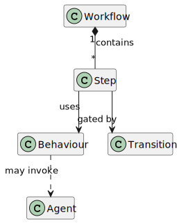

# agentforge4j-core

The framework-agnostic domain model of AgentForge4j: the immutable workflow, agent, step, command,
state, and event contracts plus the repository and SPI interfaces every other module is written
against.

## Why it exists

`core` defines *what* a workflow is and *what* a run does, without deciding *how* any of it is
executed, persisted, or talked to. It binds to no container, no database, and no LLM vendor. The
runtime, the loaders, and the providers all depend on these contracts; nothing here depends back on
them. That separation is what keeps the framework embeddable and the execution model
deterministic.

The architectural boundary is deliberate: workflow definitions and typed commands describe
behaviour, and model output is interpreted as content and commands — never as authority over
execution flow. Control of the run stays with the runtime. Values entering a run carry
provenance (`ContextValue`, `ContextProvenance`, `UntrustedInputEnvelope`) so the runtime can keep
untrusted input from being treated as trusted instruction.



## How it fits

`core` sits directly above [`agentforge4j-util`](../agentforge4j-util/README.md) and below the
loaders, runtime, and providers. Its runtime dependencies are `agentforge4j-util`, Jackson
(`databind` + `annotations`), and Apache Commons Lang; Lombok is compile-only.

## Key public types

### Workflow and agent definitions
| Type | Purpose |
|---|---|
| `WorkflowDefinition` | An immutable, validated workflow: its steps, blueprints, and artifacts. |
| `StepDefinition` | One executable step — identity, behaviour, optional context mapping, and prompt. |
| `StepBehaviour` | The sealed behaviour of a step (agent, branch, input, resource, retry-previous, spar, sub-workflow, fail). |
| `AgentDefinition` | An agent's configuration, prompt, provider preferences, and supported commands. |
| `AgentLocality` | Where an agent executes (`LOCAL` or `CLOUD`). |
| `ArtifactDefinition` | A collection of input items the UI renders as a form. |
| `WorkflowRequirement` | A self-targeting declaration of something a workflow needs satisfied. |

### Commands
`LlmCommand` is the sealed marker interface for the typed commands a model may return as structured
JSON. The runtime dispatches on command type; free text is never parsed as control flow. The
concrete commands are `CreateFileCommand`, `SetContextCommand`, `UserPromptCommand`,
`RunCommandCommand`, `GenerateQuestionsCommand`, `ToolInvocationCommand`, `EscalateCommand`,
`ContinueCommand`, and `CompleteCommand`. The `command.schema` package renders the response schema
the model is held to.

### Runtime contract
`WorkflowRuntime` is the command model for driving a run. Its operations are `start`, `continueRun`,
`retry`, `approve`, `submitInput`, `submitReview`, `decideStepApproval`, `cancel`, the tool-decision
resume verbs `continueAfterToolApproval` and `resolveToolDecision`, and `getState` (a defensive
snapshot). `StepApprovalDecision` is the sealed `Approve`/`Reject` outcome for a `HUMAN_APPROVAL`
step gate.

Actions carry an opaque `actorId` supplied by the embedding application — `core` defines no user,
tenant, or actor concept of its own and does not interpret the value.

### State and events
| Type | Purpose |
|---|---|
| `WorkflowState` | The execution snapshot for one run: identity, status, pending gates, and context. |
| `WorkflowStatus` | The lifecycle state of a run (running, paused, the various awaiting-* pauses, and the terminal completed/failed/cancelled states). |
| `WorkflowEvent` | An immutable audit entry for a run. |
| `WorkflowEventLog` | An append-only store of events keyed by run id. |

### Repositories (implemented by consumers)
| Type | Purpose |
|---|---|
| `WorkflowRepository` | Catalog of `WorkflowDefinition` instances keyed by workflow id. |
| `AgentRepository` | Access to agent definitions. |
| `WorkflowStateRepository` | Storage for runtime state — bring your own (in-memory, JDBC, JPA). |
| `WorkflowFileRepository` | Persistence and content addressing for workflow file metadata. |

### Tool and integration SPIs
The `spi.tool` and `spi.integration` packages define governed tool use: `ToolProvider` (a source of
invocable tools, e.g. an MCP server), the read-only `ToolCatalog`, `ToolExecutionService`,
`ToolPolicy`/`ToolDecision`/`ApprovalDecision`, and the integration contracts
(`IntegrationDefinition`, `IntegrationType`, `IntegrationRepository`,
`IntegrationToolProviderFactory`, and `SecretResolver` with its `EnvironmentSecretResolver`
default). `IntegrationToolProviderFactory` is the `ServiceLoader` seam that lets modules such as
`agentforge4j-mcp` and `agentforge4j-tools-http` contribute tool providers without `core` knowing
about them.

## Public configuration

`core` reads no environment or property configuration of its own. Workflow and agent definitions
are supplied as external JSON/markdown bundles loaded by `agentforge4j-config-loader`; persistence
and LLM wiring are provided by the modules that depend on `core`.

## Maven coordinates

```xml
<dependency>
  <groupId>org.agentforge4j</groupId>
  <artifactId>agentforge4j-core</artifactId>
</dependency>
```

## JPMS module name

```java
requires agentforge4j.core;
```

Exported packages span `com.agentforge4j.core.agent`, `.command` (+ `.command.schema`), `.runtime`,
`.workflow` and its sub-packages (`.step`, `.step.behaviour`, `.step.blueprint`, `.step.loop`,
`.step.retry`, `.step.spar`, `.context`, `.requirement`, `.artifact`, `.event`, `.file`, `.state`,
`.repository`), `.exception`, and the `.spi.tool` / `.spi.integration` SPIs.

## Constraints

`core` carries no Spring, IO, database, or LLM-vendor types, and no tenant/user/actor concept.
Keeping it free of those is what lets it be embedded directly in any Java application.

## Licence

Apache 2.0. See the root [LICENSE](../LICENSE) and the [project README](../README.md).
