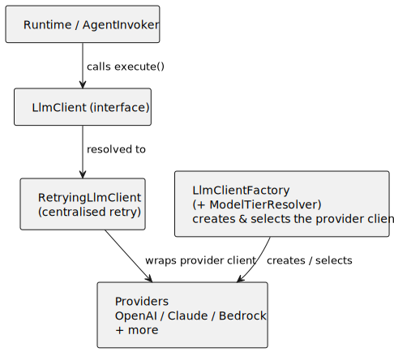

# agentforge4j-llm

Provider discovery and configuration for AgentForge4j's LLM layer: the `ServiceLoader` factory
contract every provider implements, the configuration and secret-resolution types they share, and
the shipped tier-to-model defaults.

## Why it exists

[`agentforge4j-llm-api`](../agentforge4j-llm-api/README.md) defines *how to call* a model;
this module defines *how a provider is found and configured*. It owns `LlmClientFactory` — the
contract a provider module publishes via `ServiceLoader` — together with the neutral configuration,
options, and secret-reference types that let the bootstrap layer wire any provider the same way. It
also holds `ShippedModelTierDefaults`, the single source of truth for which model each provider uses
at each capability tier. Centralising the discovery seam here means adding a provider is purely
additive: drop its JAR on the path and it is found.



## How it fits

`agentforge4j-llm` requires [`agentforge4j-llm-api`](../agentforge4j-llm-api/README.md) (transitively)
and [`agentforge4j-util`](../agentforge4j-util/README.md), and uses Jackson, Apache Commons Lang, and
`java.net.http`. The runtime and bootstrap depend on it; the provider adapters implement its
`LlmClientFactory` and are discovered through it.

## Key public types

| Type | Purpose |
|---|---|
| `LlmClientFactory` | The `ServiceLoader` provider contract: `getProviderName()`, `requiresApiKey()` (default `true`), `create(LlmClientFactoryContext)`. |
| `LlmClientFactoryContext` | Inputs handed to a factory: object mapper, resolved `LlmClientConfiguration`, secret resolver, plus `requireApiKey()`/`apiKey()` helpers. |
| `LlmClientConfiguration` | Neutral transport for provider settings: provider name, default model, base URL, connect timeout, retry policy, api-key reference, and typed options. |
| `LlmProviderOptions` | Typed accessor for provider-specific options (`string`/`integer`/`bool`/`duration`/`decimal`). |
| `LlmSecretReference` / `LlmSecret` / `LlmSecretResolver` | Opaque credential reference, resolved secret holder (both redacting in `toString()`), and the resolver contract. |
| `ShippedModelTierDefaults` | The shipped tier→model map for every bundled provider (`asMap()`). |
| `LlmProviderConfigurationException` | Raised when a provider's configuration is missing or invalid. |

## Public configuration

This module defines the configuration *types* but reads no environment or properties itself — the
bootstrap facade and the Spring starter populate `LlmClientConfiguration` from their own sources. See
each provider module and [`agentforge4j-bootstrap`](../agentforge4j-bootstrap/README.md) for the
concrete keys.

## Maven coordinates

```xml
<dependency>
  <groupId>org.agentforge4j</groupId>
  <artifactId>agentforge4j-llm</artifactId>
</dependency>
```

## JPMS module name

```java
requires agentforge4j.llm;
```

Exports `com.agentforge4j.llm` and declares `uses com.agentforge4j.llm.LlmClientFactory`.

## Licence

Apache 2.0. See the root [LICENSE](../LICENSE) and the [project README](../README.md).
