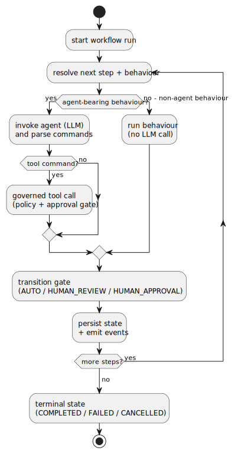

# agentforge4j-runtime

The workflow execution engine: the implementation of `WorkflowRuntime` that drives a run through its
steps, records every transition as an event, and pauses at human gates so a run can resume exactly
where it left off.

## Why it exists

`core` says what a run *is*; this module makes one *happen*. It executes each step's behaviour,
dispatches the typed commands a model returns, persists state and appends audit events through the
repositories, enforces nesting limits on sub-workflows, and suspends at approval, review, input, and
tool-decision gates. Workflow configuration owns the control flow here — model output supplies
content and commands but never decides what runs next.



## How it fits

`agentforge4j-runtime` depends on [`agentforge4j-core`](../agentforge4j-core/README.md),
[`agentforge4j-util`](../agentforge4j-util/README.md),
[`agentforge4j-llm-api`](../agentforge4j-llm-api/README.md),
[`agentforge4j-llm`](../agentforge4j-llm/README.md),
[`agentforge4j-config-loader`](../agentforge4j-config-loader/README.md), and
[`agentforge4j-schema`](../agentforge4j-schema/README.md). Most applications do not construct it
directly — [`agentforge4j-bootstrap`](../agentforge4j-bootstrap/README.md) assembles it for you.

## Key public types

| Type | Purpose |
|---|---|
| `DefaultWorkflowRuntime` | The engine — the `core` `WorkflowRuntime` implementation. Constructed through its builder. |
| `WorkflowRuntimeBuilder` | Assembles a `DefaultWorkflowRuntime` from its collaborators (used by the bootstrap layer). |
| `RunExecutionInterceptor` | The control seam: `beforeMainExecution` and `beforeLlmCall` (both default no-op) may throw `ExecutionBlockedException` to veto execution. `NO_OP` is the shared default. |
| `LlmCallContext` / `RunExecutionContext` | The contexts passed to the interceptor hooks. |
| `ExecutionBlockedException` | Thrown by an interceptor to block a run or an LLM call. |
| `EventRecorder` | Records workflow events to the event log. |
| `FileSink` | Destination for `CreateFileCommand` output, with `LocalFileSink` and `NoOpFileSink` implementations. |

## Public configuration

The runtime takes its configuration through `WorkflowRuntimeBuilder` (max nesting depth, file sink,
interceptor, and the repositories), not from environment or properties. The bootstrap facade and the
Spring starter translate their configuration into builder calls.

## Maven coordinates

```xml
<dependency>
  <groupId>org.agentforge4j</groupId>
  <artifactId>agentforge4j-runtime</artifactId>
</dependency>
```

## JPMS module name

```java
requires agentforge4j.runtime;
```

Exports `com.agentforge4j.runtime` and its `.command`, `.event`, `.repository`, `.tool`, `.llm`, and
`.interceptor` sub-packages.

## Licence

Apache 2.0. See the root [LICENSE](../LICENSE) and the [project README](../README.md).
